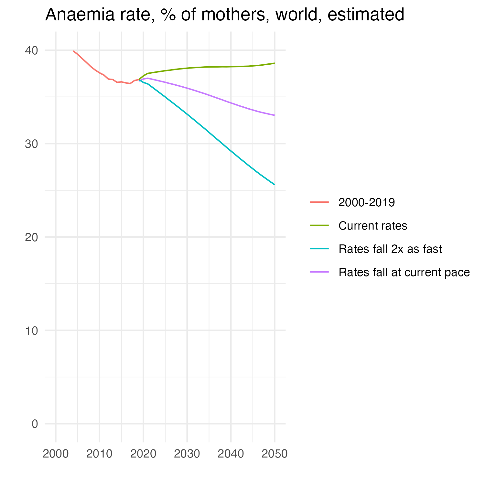
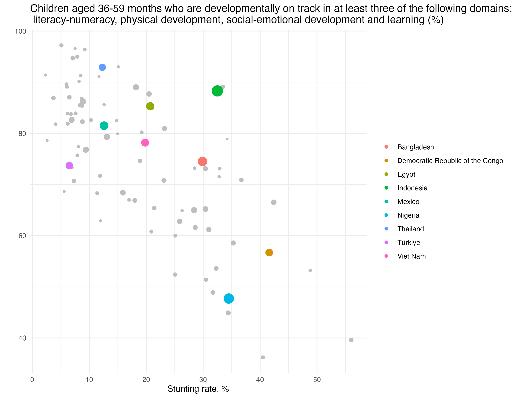

# Demography, nutrition and cognition

This repository houses _The Economist_'s data and scenarios of nutritional outcomes based on past and present incidence of nutritional deficiencies and demographic projections. 

### Contents:
1. Estimates and projections to 2050 of stunting in newborn children and anaemia in pregnant women
2. Estimates of proportion of kids who are developmentally delayed, by country
3. Charts and stats based on these metrics

## Data:
Estimates are all available in the "output-data" folder. This folder contains:
* Stunting and anaemia in pregnant women rates and incidence by country and as world totals.
  * [stunted_world_totals.csv](./output-data/stunted_world_totals.csv)
  * [stunting_by_country_with_estimates.csv](./output-data/stunting_by_country_with_estimates.csv)
  * [anaemia_by_country_with_estimates.csv](./output-data/anaemia_by_country_with_estimates.csv)
  * [anaemia_world_totals.csv](./output-data/anaemia_world_totals.csv)
* Stunting and anaemia data combined with data from UNICEF on what proportion of children aged 36-59 months who reach a mininimum number of developmental milestones (such as "can count to ten") for their age. 
  * [nutrition_and_developmental_outcomes.csv](./output-data/nutrition_and_developmental_outcomes.csv)

## Analysis
The analysis is organized into four scripts.

[01_stunting.R](./scripts/01_stunting.R) - This script takes as its inputs UN population projections and WHO country-year estimates of stunting prevalence among children under five years of age. Stunting is defined as abnormally low height for age. Where stunting rates are missing, which is the case mainly in a few high-income countries or tiny countries, stunting rates are assumed to be equal to the UN sub-region stunting rate (e.g. "Western Europe"). It assumes that a child's probability of being stunted is equal to the rate of stunting among those under five in the country in the child's year of birth. This enables us to calculate the world-wide stunting rate over time. It then calculates three scenarios. The first is if stunting continues at current rates, in this case 2022 values (which are the latest data point). The second is what would happen if trends of the past decade continue, or to be precise, the most recent decade of data. To estimate this, it uses a quasi-binomial generalised linear model with logit link with country fixed effects interacted with a year trend. The script offers various calibration plots to assess if such projections are reasonable. The third scenario estimates what would happen if rates declined twice as fast as projected based on trends of the past decade (and no country did worse).

[02_anaemia.R](./scripts/02_anaemia.R) - This script takes as its inputs UN population projections and WHO country-year estimates of anaemia prevalence in pregnant women. The approach is largely identical to that of the script to investigate stunting rates. Where rates are missing, which is the case mainly in a few high-income countries or tiny countries, rates are assumed to be equal to the UN sub-region rate (e.g. "Western Europe"). It then calculates three scenarios. The first is if anaemia in pregnant women continues to occur at current rates, in this case 2019 values (which are the latest data point). The second is what would happen if trends of the most recent decade continue, or to be precise, the most recent decade of data. To estimate this, it uses a quasi-binomial generalised linear model with logit link with country fixed effects interacted with a year trend. The script offers various calibration plots to assess if such projections are reasonable. The third scenario estimates what would happen if rates declined twice as fast as projected based on trends of the past decade (and no country did worse).

[03_general_development.R](./scripts/03_general_development.R) - This script combines the stunting, anaemia, and demographic data with data on the proportion reaching developmental milestones from surveys, specifically, "children aged 36-59 months who are developmentally on track in at least three of the following domains: literacy-numeracy, physical development, social-emotional development and learning", as well as GDP per capita at purchasing power parity from the World Bank. Each survey is combined with the stunting, anaemia, birth and gdp per capita estimates from that year in the country in question.

[04_world-totals.R](./scripts/04_world-totals.R) - This script loads data on worldwide estimates and scenarios of stunting and anaemia rates and absolute numbers so that one can quickly inspect and chart it. 

Many of the charts used based on this data have versions available in the "plots" folder of this repository. If you have any questions about this analysis or spot an error or opportunity for improvement, please open an issue or email "sondresolstad@economist.com".

## Notes
* Our analysis is based on data and estimates which have considerable uncertainty. This should be kept in mind when interpreting the figures. While uncertainty in global figures should be less than the sum of uncertainty in country-level data, we are not able to provide it, as the micro-data required to quantify it is not available (it depends on correlations in errors between countries).
* Our scenarios are just that, scenarios: they should not be seen as predictions. 
* Data on malnutrition is not perfect. Some countries have no data. In these instances we have had to rely on sub-regional averages. Data is also released with a lag: for anaemia in pregant women, data ends in 2019, and for stunting rates, in 2022. 
* To estimate worldwide rates, country-level estimates were weighted by number of births in the country. While this is, as far as we know, the best approach possible, the number of pregnant women is slightly different from the number of births in a country in a given year. If these differences varies in a way correlating with anaemia rates, they could affect our estimates. Relatedly, stunting rates in under-5s is taken as a proxy for the expected stunting rate among children born in the country in that year, a highly related but different quantity.   

## Sources:
* [UN population projections](https://population.un.org/wpp/) - United Nations Department of Economic and Social Affairs, Population Division (2022). World Population
Prospects 2022: Summary of Results. UN DESA/POP/2022/TR/NO. 3. 
* [WHO Global Health Observatory Data](https://www.who.int/data/gho) - World Health Organization. (2023). Global health observatory data repository.
* [UNICEF](https://data.unicef.org/topic/early-childhood-development/development-status/) - UNICEF. (2024). The development status of children varies widely among countries. URL: https://data.unicef.org/topic/early-childhood-development/development-status/#status
* [World Bank](https://data.worldbank.org/indicator/NY.GDP.PCAP.PP.CD) - International Comparison Program, World Bank | World Development Indicators database, World Bank | Eurostat-OECD PPP Programme.
